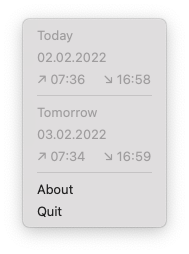

<div align="center">
  <h1>Sunset Time</h1>
  
  A simple tray app showing the current sunrise or sunset for given geolocation.

  <br />
  
  <br />
  
</div>

A lightweight version of https://github.com/vojty/sunset-app

## Setup

1.  Create `.sunset-time.toml` file in your home directory

```
# ~/.sunset-time.toml

latitude = 50.073658
longitude = 14.41854
```

2. Run the app

## Work in progress 🚧

- add github action for an automatic release
